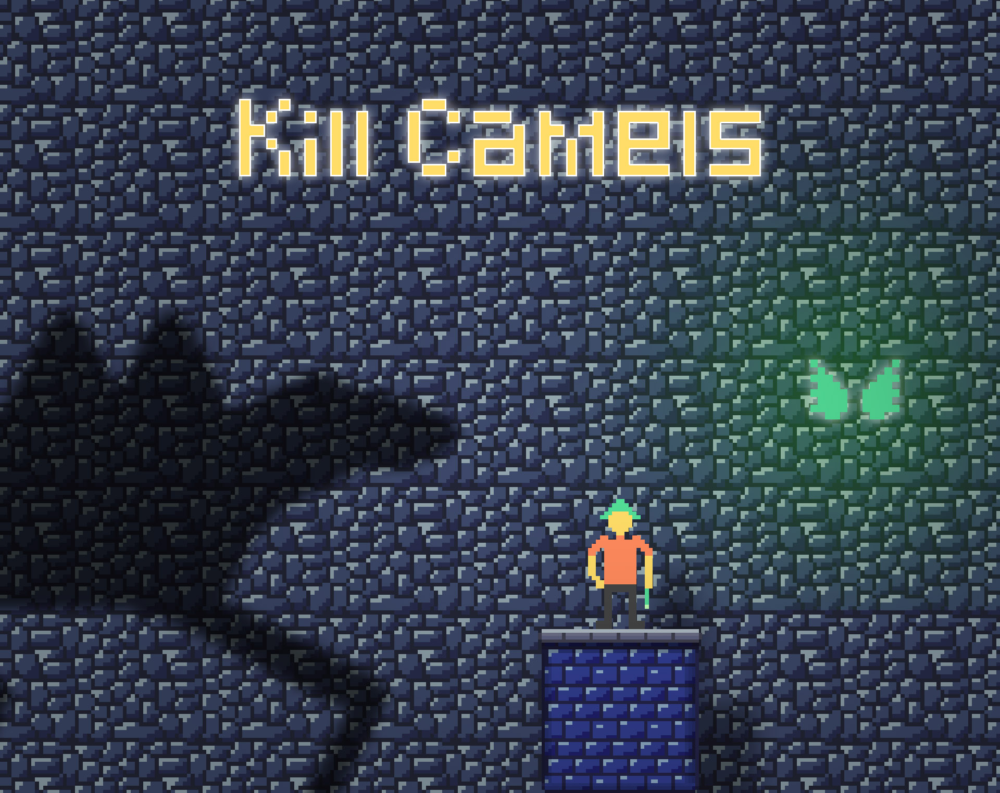

# Kill-Camels
A 2d platformer game made in one week for a Game Jam.

The theme was "Magic and spells"

## Some screenshots

## Some features
This is a 2D platformer made with Unity.

You use spells to kill camels !
This game has 3 parts : Learning, Training and Fighting.

All textures, sounds and code are free and under the MIT licence.
Assets includes a _Raw folder with Photoshop and FL Studio files.

## Some links
[Check it on Itch.IO](https://cc618.itch.io/kill-camels "Itch.IO")
